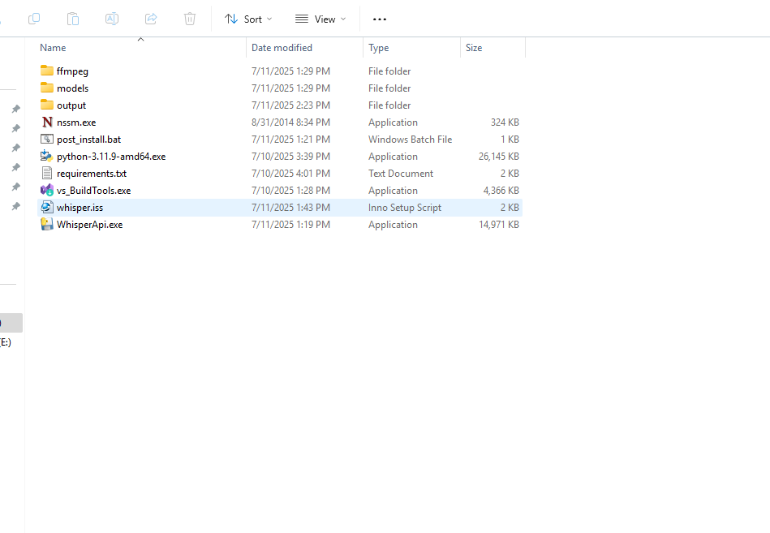

# 🗣️ Whisper API Transcription Tool

A GUI + API application to transcribe audio files using OpenAI's Whisper models. This project includes:
- A Python-based **Flask API** (`app.py`)
- A **Tkinter GUI** frontend (`GUI.py`)
- Model switching and advanced options
- A full build + installer workflow using **PyInstaller** and **Inno Setup**

---

## 📁 Project Structure
.
├── app.py # Flask API
├── GUI.py # Tkinter GUI
├── model_cache/ # Whisper models
├── requirements.txt
├── post_install.bat
├── nssm.exe
├── whisper.iss # Inno Setup script
├── dist/ # PyInstaller output
└── env/ # Python virtual environment

---

## 🛠️ Build Instructions

### 1. Build the API (`app.py`)

Use PyInstaller to build the API **as a folder** (not single file):

```bash
pyinstaller app.py ^
  --paths=env/Lib/site-packages ^
  --hidden-import=whisper ^
  --hidden-import=torch ^
  --hidden-import=torchaudio
pyinstaller app.py  --paths=env/Lib/site-packages --hidden-import=whisper --hidden-import=torch --hidden-import=torchaudio


pyinstaller --noconfirm --windowed --onefile GUI.py --name=WhisperApi


BuildExe/
├── WhisperApi.exe               # GUI
├── models/
│   ├── app/
│   │   └── app.exe              # API
│   └── model_cache/            # Whisper models


#4️⃣ Create Installer with Inno Setup
#Download & install Inno Setup: https://jrsoftware.org/isinfo.php

#Open the whisper.iss file in the Inno Setup Editor.

#Confirm paths to:

#WhisperApi.exe

#models/app/app.exe

#models/model_cache/

#Click Compile.

#You will get a standalone installer .exe that installs everything into the proper structure on the user's machine.

✅ Installer Output
#When the installer is run, it will:

#Install the GUI as WhisperApi.exe

#Install the backend API (app.exe) into models/app/

#Install preloaded Whisper models inside models/model_cache/

#Optionally run a post_install.bat for setup tasks


## 